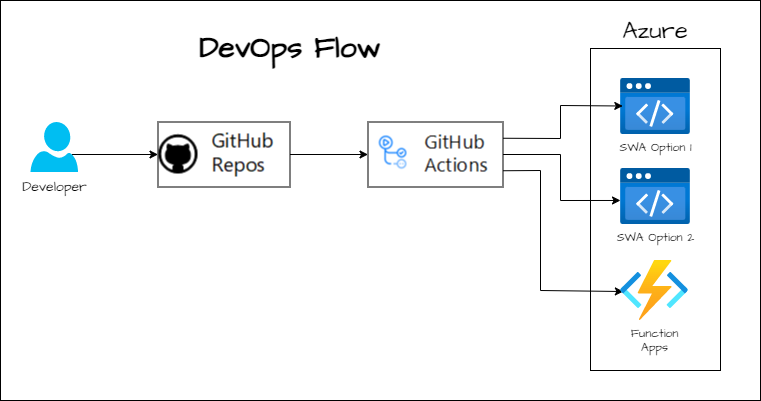

# cognitive-search-demo

This is anapplication that demonstrates how to use Azure Cognitive Search to build a search experience for a web application.

## Infrastructure as Code

Developer checks in Infrastructure as Code **(*IaC*)** changes for infrastructure definitions in the bicep file this GitHub repository. This will trigger a GitHub Actions to kick off to compile and deploy the infrastructure into Azure.

## DevOps Flow

Developer checks in code changes for the application into the GitHub repository. This will trigger a GitHub Actions to kick off to compile and deploy the application into Azure.

## Cloud Infrastructure

The file [README.md](./bicep/README.md) will explain how to run commands to initiate the deployment of the infrastructure into Azure. Here is an overview of what will be built with this repository:

## Components

- [GitHub](https://github.com/) is a code-hosting platform for version control and collaboration. A GitHub source-control [repository](https://docs.github.com/github/creating-cloning-and-archiving-repositories/about-repositories) contains all project files and their revision history. Developers can work together to contribute, discuss, and manage code in the repository.
- [GitHub Actions](https://github.com/features/actions) provides a suite of build and release workflows that covers continuous integration (CI), automated testing, and container deployments.
- [Azure Static Web Apps](https://azure.microsoft.com/services/app-service/static) is a fully managed app service that enables you to build and deploy full-stack web apps directly from a GitHub repository. The service builds and deploys your app, and provides a global content delivery network (CDN) for your static content.
- [App Insights](https://learn.microsoft.com/en-us/azure/azure-monitor/app/app-insights-overview) is a feature of Azure Monitor that provides a rich set of analytics tools to help you monitor your application's health and performance. It can automatically detect common problems and includes powerful analytics tools to help you diagnose issues and to understand what users actually do with your app.
- [Azure Functions](https://azure.microsoft.com/services/functions) is a serverless compute service that lets you run code on-demand without having to explicitly provision or manage infrastructure. Azure Functions can be used to extend other Azure services or to build your own back-end services. It enables you to write event-driven serverless code, maintain less infrastructure, and save money.
  - [Service Bus trigger for Azure Functions](https://learn.microsoft.com/en-us/azure/azure-functions/functions-bindings-service-bus-trigger) enable you to respond to an event sent to an service bus message.
  - [Azure SignalR Service output binding for Azure Functions](https://learn.microsoft.com/en-us/azure/azure-functions/functions-bindings-signalr-service-output) enables you to send messages by using Azure SignalR Service.
- [Azure Storage](https://learn.microsoft.com/en-us/azure/storage/common/storage-introduction) is a Microsoft-managed cloud service that provides highly available and secure storage that scales as your needs grow. Storage is a general-purpose storage account that can be used for a variety of data types and scenarios.
- [Azure Key Vault](https://learn.microsoft.com/en-us/azure/key-vault/general/overview/) securely stores and controls access to secrets like API keys, passwords, certificates, and cryptographic keys. Azure Key Vault also lets you easily provision, manage, and deploy public and private Transport Layer Security/Secure Sockets Layer (TLS/SSL) certificates, for use with Azure and your internal connected resources.
- [Azure SignalR Service](https://azure.microsoft.com/services/signalr-service) simplifies the process of adding real-time web functionality to applications over HTTP with minimal effort.
- Azure Cache for Redis is a fully managed, Redis-compatible in-memory data store that can be used as a distributed cache for web apps, mobile apps, gaming, and other scenarios.
- [Azure Cognitive Search](https://azure.microsoft.com/en-us/products/search) is a fully managed cloud search service that provides a rich search experience to custom applications. It is a search-as-a-service solution that allows developers to add a search capability to their applications with little or no prior experience in developing search functionality.
- [Azure Service Bus](https://learn.microsoft.com/en-us/azure/service-bus-messaging/service-bus-messaging-overview) is a fully managed enterprise integration message broker. Service Bus can decouple applications and services. Applications and services can be loosely coupled using asynchronous messaging patterns.

## Data Flow

This repository demostrates two ways of ingesting data into Azure Cognitive Search.

### Option 1

The first option is a minimal infrastructure option where the static web app will directly interact with the search service.

### Option 2

The second option **(*highly recommended*)** is to separate the backend concern completely with a microservice exposing apis hosted in Azure Functions to interact with the search service and also use a messaging service and cache results for performance.

This option seems to be the best option for a production application. It does have a bit more lines in the infrastructure diagram so here it is broken down by steps:

1. First the key vault serves the keys it needs for that environment and so the apps know where to go for all the backend services. In this step will also connect the front end user interface to the SignalR service.

    
2. Next, this diagrams shows the flow of data from the front end user interface to the backend services to add or update a record in the search service. The front end user interface will send a request to the Azure Functions API. The Azure Functions API will then send a message to be queued into the Azure Service Bus. This is great for performace as it does not block the user interface while process happens in the background.

    
3. As the Azure Function has a binding subscription to the Azure Service Bus queue, a trigger will happen for the message to then flow to the Azure Functions in the background to be processed. The Azure Function  will then send a message to the Azure Cognitive Search service and after it receives a successful message it will send a notification to the user via the Azure SignalR Service.

    
4. To make a simple query to the search service, the front end user interface will send a request to the Azure Functions API. The Azure Functions API will then send a message to be cache service via an input binding. If it is there it returns the result. If it is not there, it queries the search service and caches the result for future queries' performace. It then returns the user the result.

    

## Running the applications

Follow the instructions in this [README](./DEVELOPMENT.md) file to run the application.
